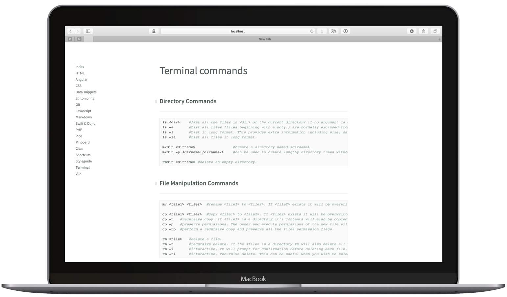

# Bits and Pieces theme for Pico



I have long searched for a way to store useful bits and pieces for reference; snippets of Javascript, odd CSS selectors, how to exit vim etc. General purpose bins like Evernote where you're supposed to throw everything into it has never really worked for me. It always ends up looking like my desk – messy and disorganized. 

For the last couple of years I have stored my reference files as markdown files with front-ends to render them. For a while I have used [Pico CMS](http://picocms.org) as my front-end together with this minimalistic theme I have made.

The theme is really simple and barebone and can easily be customized and extended to suit your needs.

## Getting started

### My setup

My prefered way is to simply run the site locally on my machine. That way it's super fast and I don't have to worry about securing the site, restricting access and such.

### Installation

Download the repository and put the `bitsandpieces` folder in the `themes` folder in Pico and update the config.php with the following settings:

```php
$config['theme'] = 'bitsandpieces';
```

### Editing content

I personally edit my references files using texteditors and doesn't use any admin backend or page admin plugin. I have set up an [Alfred](https://www.alfredapp.com) workflow to do a keyworded file search inside my content directory so when I want to edit a page a simply hit `cmd-space` and type `ref ter` which opens the file terminal.md located in the contents folder in my prefered text editor, which at the moment is Typora.

I also keep my reference files as a private git repository on github so I can access and edit them anywhere on any device where I have an internet connection. Much easier than having to fiddle with a webserver to dropbox setup.

## Theme specific guidelines

### Navigation

The theme has currently no sub navigation. Regardles of the folder structure in your content directory all pages will be rendered in a flat list

### Keyboard shortcuts
Assign keyboard shortcuts to quickly switch between pages. Add the metadata `Shortcut: <key>` in the YAML header to assign the key to the page. Use `+` to make key combos. [Look at mousetrap documentation to see what you can do](https://craig.is/killing/mice)

```yaml
---
Title: Bits and Pieces theme for Pico
Shortcut: alt+1
---
```

The above example will open the Bits and Pieces page when the keys `alt` and `1` keys are pressed simultaneously

### Titles

Do include a level 1 header in your content `# this is a H1`. The title you specify in the front matter is used only for the navigation and does not render with the content.

### Headings

The theme only provide styles for the first three levels of headers and style the remaining headers as bold text. It's my opinion that if you need more than three levels of hierarchy you'd better split the content into different files

### Code snippets

Code highligt are rendered using [highlight.js](https://highlightjs.org). Put the language right after the three backticks to get proper language highlighting. To see what language prefix to use see [highlight.js documentation](http://highlightjs.readthedocs.io/en/latest/css-classes-reference.html#language-names-and-aliases).

```markdown
​```html
<h1>Hello world!</h1>
​```
```

### Load external css files

Add the following setting in`config.php` to load external css files.

```php
$config['external_css'] = array(
  'url/to/external/css-file-1.css',
  'url/to/path-to/file-2.css',
);

```

### Browser compability

Since this theme is not intended for a public facing website I have taken the freedom to support only web browsers I use in my daily life which is **Safari** and **Chrome** for Mac and iOS. The theme also uses some bleeding edge css like native css variables and position sticky (which is unfortunately not available on chrome yet). So don't expect the theme to run on Internet Explorer. Maybe Edge. But I haven't tested and I probably won't either until Apple stops making macs.


_Sticky headers on safari_
